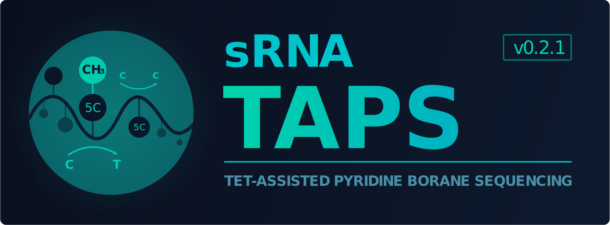

<p align="center">
  
</p>
<p align="center"><strong>TAPS-based m5C and 5hmC detection pipeline for small RNA sequencing</strong></p>

<p align="center">
  
  
  
  
  
  <a href="https://github.com/HenzelerB/sRNA-TAPS/actions/workflows/ci.yml"></a>
  <a href="https://github.com/HenzelerB/sRNA-TAPS/releases/tag/v0.3.0"></a>
  
</p>

<p align="center">
sRNA-TAPS detects 5-methylcytosine (m5C) and 5-hydroxymethylcytosine (5hmC) in small RNA using TET-assisted pyridine borane sequencing (TAPS). It covers miRNA, tRNA, rRNA, snoRNA, snRNA, piRNA, and lncRNA biotypes from human samples (hg38), and was developed from the original DNA TAPS method (Liu et al., <em>Nature Biotechnology</em> 2019) for biological RNA without synthetic spike-in controls.
</p>

---

## 📋 Table of Contents

<ol>
  <li><a href="#-chemistry">Chemistry</a></li>
  <li><a href="#-experimental-design">Experimental Design</a></li>
  <li><a href="#️-installation">Installation</a></li>
  <li><a href="#-quick-start">Quick Start</a></li>
  <li><a href="#-test-dataset">Test Dataset</a></li>
  <li><a href="#-v030-validation">v0.3.0 Validation</a></li>
  <li><a href="#-usage">Usage</a></li>
  <li><a href="#-pipeline-overview">Pipeline Overview</a></li>
  <li><a href="#-pipeline-steps-in-detail">Pipeline Steps in Detail</a></li>
  <li><a href="#-the-delta-δ-score">The Delta (δ) Score</a></li>
  <li><a href="#️-snp-filtering">SNP Filtering</a></li>
  <li><a href="#-output">Output</a></li>
  <li><a href="#-requirements">Requirements</a></li>
  <li><a href="#-citation">Citation</a></li>
  <li><a href="#️-license">License</a></li>
  <li><a href="#️-affiliation">Affiliation</a></li>
</ol>

---

## 🧪 Chemistry

TAPS works through two sequential reactions: TET enzymes oxidise m5C and 5hmC to 5-carboxylcytosine (5caC), which pyridine borane then reduces to dihydrouracil (DHU). DHU is read as T during PCR. Unmodified cytosines pass through the chemistry unchanged, so the readout is the opposite of bisulfite sequencing: a C→T transition marks a modified base rather than an unmodified one.

#### Why TAPS for small RNA?

Bisulfite treatment degrades short RNA molecules and converts ~99% of unmodified cytosines, making short reads difficult to align. sRNA-TAPS uses a three-letter Bowtie1 strategy: reads and references are converted for alignment, both genomic strands are searched independently, and the original read sequence and qualities are restored before C-to-T calling. This prevents genuine TAPS conversions from consuming the mismatch budget.

#### Why not use lambda phage spike-ins?

Lambda spike-ins calibrate conversion efficiency for double-stranded DNA. TET enzymes act differently on RNA, and the adapter ligation and reverse transcription steps in small RNA library preparation do not process DNA spike-ins the same way. sRNA-TAPS uses `pb_Ctrl` samples for position-specific background correction instead, with mitochondrial rRNA m5C sites (C1402, C1407 in 12S rRNA) as internal positive controls for chemistry conversion.

---

## 🔬 Experimental Design

Three conditions are required:

| Condition | Treatment | Purpose |
|-----------|-----------|---------|
| `treat` | TET oxidation + pyridine borane | Full TAPS — detects 5mC and 5hmC |
| `pb_Ctrl` | Pyridine borane only (no TET) | Captures chemistry background without TET |
| `no-treat` | No chemistry | Sequencing error baseline |

The `pb_Ctrl` condition is essential. Pyridine borane converts a small fraction of unmodified cytosines non-specifically (~8–9%), and this background varies by sequence context. Subtracting `pb_Ctrl` rates from `treat` at each position leaves only the TET-dependent signal.

---

## ⚙️ Installation

#### From source (current release method)

```bash
git clone https://github.com/HenzelerB/sRNA-TAPS
cd sRNA-TAPS
git checkout v0.3.0
python -m pip install -e .
```

The package is not yet published to PyPI or Bioconda. Install from the tagged
GitHub source release until those distribution channels are announced.

#### Full environment

```bash
conda env create -f environment.yaml
conda activate RNA_taps
python -m pip install -e . --no-deps
```

#### R packages (for report figures)

Required for publication-ready figure generation. Report figures are generated automatically as part of the pipeline, but R packages must be installed first.

```bash
Rscript install_R_packages.R
```

---

## 🚀 Quick Start

sRNA-TAPS runs as a Snakemake 9 profile-based workflow. All SLURM resource allocation is handled by the profile — no manual cluster submission strings needed.

```bash
# 1. Set up a project directory
mkdir ~/my_taps_project
cd ~/my_taps_project

# 2. Add your raw FASTQs
mkdir rawfiles
# copy *.fq.gz into rawfiles/

# 3. Create config.yaml and samples.tsv (see Usage section)

# 4. Run the full pipeline
bash /path/to/sRNA-TAPS/sRNA_taps.bash

#    — or directly with Snakemake —
snakemake \
    --snakefile /path/to/sRNA-TAPS/srnataps/workflow/Snakefile \
    --configfile config.yaml \
    --profile    /path/to/sRNA-TAPS/srnataps/workflow/profiles/slurm

# 5. Run with benchmarking (optional — slow, manuscript-only)
snakemake \
    --snakefile /path/to/sRNA-TAPS/srnataps/workflow/Snakefile \
    --configfile config.yaml \
    --profile    /path/to/sRNA-TAPS/srnataps/workflow/profiles/slurm \
    all_benchmark
```

The pipeline automatically downloads the GRCh38 genome from Ensembl and builds the Bowtie1 index if they are not already present. Report figures are generated at each stage without any additional steps.

---

## 🧬 Test Dataset

Version 0.3.0 was validated with an independently generated 100-sample hg38
benchmark containing 638 planted modification sites across miRNA, tRNA, rRNA,
snoRNA, and snRNA. It includes 34 treatment, 33 PB-only control, and 33
no-treatment libraries. The benchmark dataset is not bundled with the source
distribution because the generated FASTQ and alignment files are large.

For any simulator that emits the same `truth.tsv` coordinate schema, evaluate
pipeline calls with:

```bash
srnataps evaluate \
    --truth truth.tsv \
    --calls-dir 07d.replicate_calls \
    --samples-tsv samples.tsv \
    --outdir 10.truth_evaluation \
    --condition treat
```

Truth-based evaluation is for synthetic validation only. It is not used by the
caller and must not be used to tune thresholds on biological experiments.

---

## ✅ v0.3.0 Validation

The complete benchmark was run through three-letter alignment, strand-aware
SNP filtering, pooled controls, BAM-derived replicate testing, and the
integrated Snakemake condition module.

| Validation result | Outcome |
|-------------------|---------|
| Linux unit and focused integration tests | 58 passed |
| GitHub Actions distribution build | Passed |
| Simulated samples processed | 100/100 |
| Integrated condition DAG | 50/50 jobs completed |
| Pooled candidate recall | 99.37% |
| Replicate discovery recall | 98.59% |
| Stringent tier precision | 67.06% |
| Stringent tier recall | 88.40% |
| Stringent tier F1 | 0.763 |

These figures describe the planted simulation and establish software behavior;
they are not expected performance guarantees for biological samples. Biological
validation must consider library complexity, RNA abundance, chemistry quality,
multimapping, cell type, and the absence of a fully modified RNA standard.

---

## 📖 Usage

### Project directory structure

Every sRNA-TAPS run needs a project directory containing two files:

```
my_project/
├── config.yaml      # pipeline configuration
├── samples.tsv      # sample sheet
└── rawfiles/        # input FASTQs (*.fq.gz)
```

### config.yaml

```yaml
project:
  name: my_experiment
  outdir: /path/to/my_project

reference:
  genome_fa:     /path/to/my_project/04a.genome/Homo_sapiens.GRCh38.dna.toplevel.fa
  gtf:           /path/to/my_project/04a.genome/Homo_sapiens.GRCh38.112.gtf
  bowtie1_index: /path/to/my_project/04a.genome/genome
  ensembl_release: 112    # used for automatic genome download
  dbsnp_vcf: ""           # optional — leave empty to skip dbSNP layer

output:
  fastqc:    02.fastqc
  trimmed:   03.trimGalore
  genome:    04a.genome
  aligned:   04b.aligned
  biotypes:  05.biotype_bams
  snp:       06.snp_resources
  calls:     07.taps_calls
  pooled_calls: 07b.pooled_calls
  control_contrast: 07c.control_contrast
  replicate_calls: 07d.replicate_calls
  stringent_calls: 07e.stringent_calls
  evidence_audit: 10.evidence_audit
  benchmark: 08.benchmark
  compare:   09.compare
  logs:      logs

alignment:
  strategy: three_letter
  threads: 8

condition_analysis:
  enabled: true
  pooled_min_coverage: 1
  test_min_coverage: 5
  minimum_replicates: 3
  minimum_delta: 0.10
  discovery_max_padj: 0.05
  stringent_max_padj: 1.0e-20
  stringent_min_coverage: 5

benchmark:
  tools:
    astair:
      min_depth: 5
      min_mapq:  20
      min_baseq: 20
      context:   all
```

> **Genome auto-download:** If `genome_fa` or `gtf` do not exist on disk, the pipeline downloads them automatically from Ensembl release 112 (or whichever `ensembl_release` you set) and builds the Bowtie1 index. No pre-built index is required for new users.

### samples.tsv

Tab-separated, one row per sample. Four columns are required:

| Column | Description |
|--------|-------------|
| `sample` | Unique sample identifier — used for all output filenames |
| `condition` | Experimental condition — any name; must cover a `treat`, `pb_Ctrl`, and `no-treat` equivalent |
| `cell_line` | Cell line or biological source — any name; used to group SNP blacklists and colour palettes |
| `fastq` | Full path to the input `.fq.gz` file (single-end) |

Example with two cell lines, three conditions, three replicates each:

```
sample                  condition  cell_line  fastq
no-treat_Ctrl_HEK_R1    no-treat   HEK        /data/rawfiles/no-treat_Ctrl_HEK_R1.fq.gz
no-treat_Ctrl_HEK_R2    no-treat   HEK        /data/rawfiles/no-treat_Ctrl_HEK_R2.fq.gz
no-treat_Ctrl_HEK_R3    no-treat   HEK        /data/rawfiles/no-treat_Ctrl_HEK_R3.fq.gz
pb_Ctrl_HEK_R1          pb_Ctrl    HEK        /data/rawfiles/pb_Ctrl_HEK_R1.fq.gz
pb_Ctrl_HEK_R2          pb_Ctrl    HEK        /data/rawfiles/pb_Ctrl_HEK_R2.fq.gz
pb_Ctrl_HEK_R3          pb_Ctrl    HEK        /data/rawfiles/pb_Ctrl_HEK_R3.fq.gz
treat_HEK_R1            treat      HEK        /data/rawfiles/treat_HEK_R1.fq.gz
treat_HEK_R2            treat      HEK        /data/rawfiles/treat_HEK_R2.fq.gz
treat_HEK_R3            treat      HEK        /data/rawfiles/treat_HEK_R3.fq.gz
no-treat_Ctrl_Caco2_R1  no-treat   Caco2      /data/rawfiles/no-treat_Ctrl_Caco2_R1.fq.gz
...                     ...        ...        ...
```

> **Minimum requirement:** At least 3 replicates per condition are needed for reproducibility filtering. Condition and cell line names can be anything — the R scripts auto-detect them from `samples.tsv`. Multi-cell-line datasets are fully supported.

### Running the pipeline

**Option 1 — tmux launcher (recommended for SLURM clusters):**

```bash
cd /path/to/my_project
bash /path/to/sRNA-TAPS/sRNA_taps.bash
# Attach to the session: tmux attach -t sRNA_TAPS
# Detach without stopping: Ctrl+B then D
```

**Option 2 — direct Snakemake (background):**

```bash
cd /path/to/my_project
snakemake \
    --snakefile /path/to/sRNA-TAPS/srnataps/workflow/Snakefile \
    --configfile config.yaml \
    --profile    /path/to/sRNA-TAPS/srnataps/workflow/profiles/slurm &
```

**Dry-run first (always recommended):**

```bash
snakemake \
    --snakefile /path/to/sRNA-TAPS/srnataps/workflow/Snakefile \
    --configfile config.yaml \
    --profile    /path/to/sRNA-TAPS/srnataps/workflow/profiles/slurm \
    --dry-run
```

**Benchmarking (opt-in):**

```bash
snakemake \
    --snakefile /path/to/sRNA-TAPS/srnataps/workflow/Snakefile \
    --configfile config.yaml \
    --profile    /path/to/sRNA-TAPS/srnataps/workflow/profiles/slurm \
    all_benchmark
```

**Condition-level evidence analysis:**

```bash
srnataps module condition --configfile config.yaml --slurm
```

This module pools matched `treat`, `pb_ctrl`, and `no_treat` samples by cell
line, performs unbiased replicate-aware beta-binomial testing, and writes both
discovery and configurable stringent evidence tiers.

### Monitoring

```bash
# Check running SLURM jobs
squeue -u $USER

# Watch Snakemake log
tail -f .snakemake/log/$(ls -t .snakemake/log/ | head -1)
```

---

## 🔄 Pipeline Overview

```
rawfiles/           Raw FASTQs (SE, TruSeq small RNA)
    ↓
    [Genome setup — runs once per genome, skipped if files exist]
    download_genome   Download GRCh38 FASTA from Ensembl
    download_gtf      Download GRCh38 GTF from Ensembl
    index_genome_fa   samtools faidx
    bowtie1_index     Build Bowtie1 index
    ↓
01. FastQC (pre-trim)   QC on raw reads
02. Trim Galore         TruSeq SR adapter trimming (--small_rna)
03. FastQC (post-trim)  QC on trimmed reads
04. Three-letter Bowtie1 C-to-T/G-to-A alignment; original sequences restored
05. Biotype split       miRNA > tRNA > piRNA > snoRNA > snRNA > rRNA > lncRNA > other
06. SNP filter          3-layer: cell-line-specific + heterozygosity [+ dbSNP]
07. TAPS calling        Strand-aware C/T counting and per-sample calls
07b. Pool conditions    Pool counts within condition and cell line
07c. Control contrast   Treat versus PB-only and no-treatment controls
07d. Replicate calls    Unbiased beta-binomial testing with BH correction
07e. Stringent calls    Configurable q-value, effect, and depth tier
    ↓
    [Reports — generated automatically after each stage]
    report_qc           Read length distribution, mapping rates
    report_biotype      Biotype composition
    report_modification Modification rates, top sites, condition comparison,
                        waterfall, trinucleotide context
    report_seqlogos     Sequence logos (±5 and ±10 nt, per biotype)
    multiqc             Aggregated QC HTML report
    ↓
    [Benchmarking — opt-in via `all_benchmark` target]
08. Benchmark*      rastair (CpG + all-context) · asTair (biotype BAMs) · Bismark
09. Compare*        Concordance · Pearson/Spearman correlation
    report_benchmark  Concordance heatmap, correlation, site overlap (opt-in)
```

`*` requires `all_benchmark` target

---

## 🔍 Pipeline Steps in Detail

### Genome Setup
**Tools:** wget, samtools faidx, bowtie-build

If the genome FASTA or GTF do not exist at the paths specified in `config.yaml`, the pipeline downloads them automatically from the Ensembl FTP server (release set by `ensembl_release` in config). The unmasked `dna.toplevel` FASTA is used — the repeat-masked version soft-masks cytosines, which would suppress genuine C→T TAPS modification signal. If your genome files are already present, these steps are skipped automatically.

---

### Step 1: Quality Control
**Tool:** FastQC, MultiQC

FastQC runs on raw FASTQs before and after trimming. MultiQC aggregates all results — FastQC, Trim Galore reports, and Bowtie1 alignment logs — into a single interactive HTML report. For small RNA libraries, expect a dominant length peak at 18–22 nt (miRNA) and a second peak at 26–32 nt (tRNA fragments and piRNAs). All reads will contain adapter sequence, since small RNA inserts are shorter than the read length.

---

### Step 2: Adapter Trimming
**Tool:** Trim Galore (Cutadapt)

Trim Galore removes the TruSeq small RNA 3′ adapter (`TGGAATTCTCGGGTGCCAAGG`) and quality-trims the 3′ end. Reads shorter than 18 nt or longer than 50 nt are discarded. The `--small_rna` flag sets sensible defaults for this library type.

---

### Step 3: TAPS-aware Alignment
**Tool:** Bowtie 1.3.1, SAMtools

Alignment is to the whole GRCh38 genome rather than a transcriptome. Three-letter alignment neutralizes TAPS conversions during mapping while preserving genomic coordinates for downstream annotation:

| Parameter | Purpose |
|-----------|---------|
| C-to-T branch | Converted reads align to a C-to-T reference on the forward genomic strand |
| G-to-A branch | Converted reads align to a G-to-A reference on the reverse genomic strand |
| Branch selection | The best branch is retained for each read |
| Sequence restoration | Original bases and qualities are restored before modification calling |
| Process parallelism | FASTQs are split across independent Bowtie1 processes because some Bowtie1 builds ignore `-p` |

---

### Step 4: Biotype Annotation and BAM Splitting
**Tool:** Custom Python script (pysam), Ensembl GRCh38 v112 GTF

Reads are assigned to the highest-priority overlapping biotype:

```
miRNA > tRNA > piRNA > snoRNA > snRNA > rRNA > lncRNA > other
```

Keeping biotypes in separate BAMs matters because m5C at a tRNA wobble position has completely different biological meaning from m5C in a miRNA seed region, and coverage thresholds appropriate for one biotype are not appropriate for another.

> **Note:** TAPS enriches for rRNA relative to untreated libraries due to the pyridine borane step. Biotype proportions will differ between conditions — this is expected and not a sign of a failed experiment.

---

### Step 5: TAPS Methylation Calling
**Tool:** Custom Python caller (pysam, multiprocessing)

For each cytosine position with sufficient coverage:

```
mod_rate = T_count / (C_count + T_count)
```

| Feature | Implementation |
|---------|---------------|
| **Strand-specific logic** | Forward strand: modified C reads as T. Reverse strand: modified C reads as A. |
| **CIGAR-aware parsing** | `get_aligned_pairs()` handles indels and soft-clipping without positional offset errors |
| **Multi-mapper weighting** | When `NH` or `XA` multiplicity tags are present, reads contribute `1/N` rather than 1 |
| **Base quality filter** | Bases with Phred Q < 20 are excluded |
| **Parallel processing** | Jobs distributed across chromosomes |
| **Statistical testing** | Binomial test against background rate, BH FDR correction |

Output columns: `chrom, start, end, context, mod_count, unmod_count, coverage, mod_rate, pvalue, padj, snp_flag`

---

### Step 6: Background Correction and Replicate Merging
**Tool:** Custom Python script

```
δ = treat_mod_rate − pb_Ctrl_mod_rate
```

Pooled treatment counts are compared separately with PB-only and no-treatment controls. Replicate statistics are then calculated directly from BAM-level modified and unmodified counts. Missing per-sample TSV rows are never interpreted as biological zero.

---

### Step 7: Differential Methylation Analysis
**Tool:** Custom beta-binomial condition model

Coverage defines the testable universe before statistical testing. A one-sided
beta-binomial likelihood-ratio test compares treatment with each control while
allowing between-replicate overdispersion. BH correction is applied before
effect-size filtering, avoiding selection on the same treatment-control effect
that is subsequently tested.

Outputs are intentionally tiered rather than reduced to one universal cutoff:

| Tier | Meaning |
|------|---------|
| **Pooled test universe** | Covered treatment cytosines; not modification claims |
| **Control contrast** | Pooled treatment enrichment over both controls |
| **Replicate discovery** | Replicate-supported calls at the configured discovery FDR |
| **Stringent** | Configurable q-value, effect-size, and pooled-depth evidence tier |

---

### Step 8: Genomic Annotation
**Tool:** bedtools intersect, Ensembl GRCh38 v112 GTF

Called sites are intersected with the Ensembl annotation to assign gene name, biotype, and feature. miRNA gene names follow miRBase nomenclature. Where a site overlaps multiple features, the most specific annotation is kept using the priority hierarchy from Step 4.

---

### Step 9: Report Generation
**Tools:** R (ggplot2, ggseqlogo, BSgenome.Hsapiens.UCSC.hg38), MultiQC

Report figures are generated **automatically as part of the pipeline** — no manual steps required. Each report stage runs immediately after its upstream data are ready:

| Stage | Script | Figures generated |
|-------|--------|------------------|
| `report_qc` | `01_qc.R` | Read length distributions, Bowtie1 mapping rates |
| `report_biotype` | `02_biotype.R` | Biotype composition per sample and by condition |
| `report_modification` | `03_modification.R` | Modification rate distributions, top sites, condition comparison scatter, waterfall, trinucleotide context |
| `report_seqlogos` | `05_sequence_logos.R` | Sequence logos ±5 and ±10 nt around called m5C sites |
| `report_benchmark` | `04_benchmark.R` | Concordance heatmap, Pearson correlation, site overlap (benchmark target only) |

All figures are saved in PDF, PNG, and SVG format at 300 dpi (Arial 8pt, sRNA-TAPS navy-to-teal palette).

The R scripts automatically detect conditions and cell lines from `samples.tsv` — they work for any experimental design, not just HEK/Caco2. Condition colours, labels, and comparison axes adapt to whatever is in your sample sheet. For non-standard condition naming, provide display labels via the `SRNATAPS_CONDITION_LABELS` environment variable:

```bash
export SRNATAPS_CONDITION_LABELS="treat=TET+PB,ctrl=PB only,untr=Untreated"
```

---

## Δ The Delta (δ) Score

δ is the background-corrected modification rate — the fraction of C→T signal in the treated sample that is attributable to TET-dependent oxidation rather than pyridine borane chemistry alone:

```
δ = treat_mod_rate − pb_Ctrl_mod_rate
```

For example, if a position shows 82.3% C→T in `treat` and 32.3% in `pb_Ctrl`, then δ = 0.50 — half the signal is genuine 5mC and half is chemistry noise. Without this correction, the site would appear 82% methylated.

#### Interpreting δ values

| δ value | Interpretation |
|---------|---------------|
| ~0.00 | No methylation above background |
| 0.10–0.20 | Low-level methylation |
| 0.20–0.40 | Moderate methylation — confident candidate |
| 0.40–0.70 | High methylation |
| > 0.70 | Near-stoichiometric methylation |

> δ is not absolute stoichiometry. Without a fully modified RNA standard, the actual conversion efficiency is unknown. Use δ for site discovery and cross-condition comparisons, not as an absolute measure of methylation fraction.

---

## 🛡️ SNP Filtering

A C/T heterozygous SNP produces exactly the same signal as a TAPS m5C site. sRNA-TAPS filters at three levels before any C→T counts are made:

| Layer | Method | Flag |
|-------|--------|------|
| 1 | dbSNP common C→T/G→A variants (AF ≥ 1%) — optional | `SNP_KNOWN` |
| 2 | Cell-line-specific C→T variants called from no-treat BAMs | `SNP_SAMPLE` |
| 3 | No-treat C→T rate ≥ 40% at a position (heterozygosity proxy) | `SNP_HET` |

Filtering happens upstream of the binomial test — SNP-flagged positions are excluded entirely rather than called and then filtered. The `snp_flag` column in every output TSV records the reason for exclusion. Only `PASS` sites are tested. Cross-validation with Rastair v2.1.1 adds an independent machine-learning-based SNP correction layer for benchmarking purposes.

---

## 📁 Output

```
outdir/
├── 02.fastqc/
│   ├── pre_trim/       FastQC HTML reports on raw reads
│   └── post_trim/      FastQC HTML reports on trimmed reads
├── 03.trimGalore/      Trimmed FASTQs + trim reports
├── 04a.genome/         GRCh38 FASTA + GTF + Bowtie1 index
│                       (auto-downloaded if not present)
├── 04b.aligned/        Sorted BAMs per sample + flagstat logs
├── 05.biotype_bams/    Per-biotype BAMs + biotype_composition_all_samples.tsv
├── 06.snp_resources/   SNP blacklists per cell line
├── 07.taps_calls/      Per-biotype TAPS TSVs
│                       (chrom, start, end, context, mod_count, unmod_count,
│                        coverage, mod_rate, pvalue, padj, snp_flag)
├── 07b.pooled_calls/   Condition-pooled test universes
├── 07c.control_contrast/ Pooled dual-control calls
├── 07d.replicate_calls/  Replicate-supported discovery calls
├── 07e.stringent_calls/  Configurable stringent evidence calls
├── 10.evidence_audit/   Complete pooled and replicate evidence tables
├── 08.benchmark/       rastair · asTair · Bismark outputs (opt-in)
├── 09.compare/         concordance_summary.tsv · correlation_summary.tsv (opt-in)
└── report/
    ├── multiqc_report.html      Aggregated QC (FastQC + Trim Galore + Bowtie1)
    ├── tables/evidence_tier_summary.tsv
    └── figures/                 Per-stage R figures (PDF + PNG + SVG)
        ├── 01a_read_length_distribution.*
        ├── 01b_mapping_rates.*
        ├── 02a_biotype_composition_all.*
        ├── 02b_biotype_composition_mean.*
        ├── 03a_modrate_distribution.*
        ├── 03b_top_sites.*
        ├── 03c_condition_comparison.*
        ├── 03d_waterfall.*
        ├── 03e_trinucleotide_context.*
        ├── 04a_concordance_heatmap.*   (benchmark only)
        ├── 04b_correlation.*           (benchmark only)
        ├── 04c_site_overlap.*          (benchmark only)
        ├── 05_seqlogo_combined_w5.*
        ├── 05_seqlogo_combined_w10.*
        └── 05_seqlogo_<biotype>_w{5,10}.*
```

---

## 📦 Requirements

| Tool | Version | Purpose |
|------|---------|---------|
| Python | ≥ 3.11 | Core pipeline |
| Snakemake | ≥ 9.0 | Workflow management |
| snakemake-executor-plugin-slurm | ≥ 2.7 | SLURM profile submission |
| bowtie | 1.3.1 | TAPS-aware alignment |
| samtools | ≥ 1.20 | BAM processing |
| bcftools | ≥ 1.20 | Variant calling |
| fastqc | ≥ 0.12 | Quality control |
| trim-galore | ≥ 0.6.10 | Adapter trimming |
| multiqc | ≥ 1.21 | QC aggregation |
| wget | any | Genome auto-download |
| R | ≥ 4.3 | Report figures (automatic) |
| BSgenome.Hsapiens.UCSC.hg38 | any | Sequence logos |
| bismark | ≥ 0.24 | Benchmarking only |
| rastair | ≥ 2.1 | Benchmarking only |
| asTair | ≥ 3.3 | Benchmarking only (separate conda env) |

> **asTair note:** asTair has dependency conflicts with Snakemake (requires `numpy<2` and `click<8`). Install it in a dedicated conda environment — the pipeline calls it via its full binary path automatically.

---

## 📄 Citation

If you use sRNA-TAPS, please cite:

> Simsir Ö, Henzeler B. et al. sRNA-TAPS: TAPS-based m5C detection in small RNA. *(in preparation)*

And the underlying TAPS method:

> Liu Y. et al. Bisulfite-free direct detection of 5-methylcytosine and 5-hydroxymethylcytosine at base resolution. *Nature Biotechnology* 37, 424–429 (2019). https://doi.org/10.1038/s41587-019-0041-2

---

## ⚖️ License

MIT License — see [LICENSE](LICENSE) for details.

Copyright (c) 2026 Bennett Henzeler, Institute of Chemical Epigenetics, Ludwig-Maximilians-Universität München

---

## 🏛️ Affiliation

<p align="left">
  
  <br><br>
  <a href="https://schneider.cup.uni-muenchen.de">Schneider Lab</a><br>
  Institute of Chemical Epigenetics-Munich (ICEM)<br>
  Ludwig-Maximilians-Universität München<br>
  Munich, Germany
</p>
