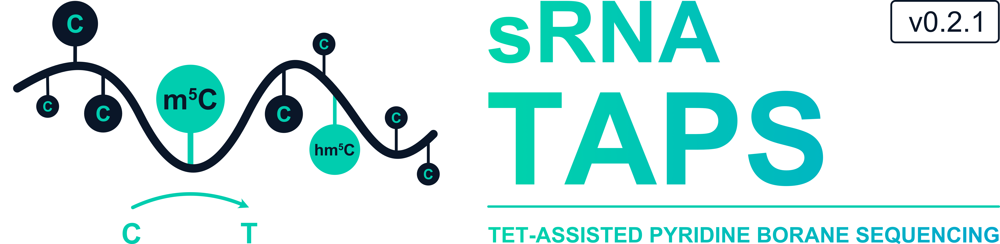

<p align="center">
  
</p>

<h1 align="center">sRNA-TAPS</h1>
<p align="center"><strong>TAPS-based m5C and 5hmC detection pipeline for small RNA sequencing</strong></p>

<p align="center">
  
  
  
  
  
  
</p>

<p align="center">
sRNA-TAPS is a pipeline for detecting 5-methylcytosine (m5C) and 5-hydroxymethylcytosine (5hmC) in small RNA using TET-assisted pyridine borane sequencing (TAPS). It supports miRNA, tRNA, rRNA, snoRNA, snRNA, piRNA, and lncRNA biotypes from human samples (hg38). The pipeline was adapted from the original DNA TAPS method (Liu et al., <em>Nature Biotechnology</em> 2019) for application to biological RNA samples without synthetic spike-in controls.
</p>

---

## 📋 Table of Contents

| Section | Contents |
|---------|----------|
| [🧪 Chemistry](#-chemistry) | TAPS mechanism, why not bisulfite, why not spike-ins |
| [🔬 Experimental Design](#-experimental-design) | Three-condition framework |
| [⚙️ Installation](#️-installation) | conda, pip, source, R packages |
| [🚀 Quick Start](#-quick-start) | Init, validate, run |
| [🧬 Test Dataset](#-test-dataset) | Synthetic FASTQs, expected results, validation |
| [📖 Usage](#-usage) | CLI reference, run options, modules |
| [🔄 Pipeline Overview](#-pipeline-overview) | Step-by-step diagram |
| [🔍 Pipeline Steps in Detail](#-pipeline-steps-in-detail) | QC → Trim → Align → Call → Report |
| [Δ The Delta Score](#-the-delta-δ-score) | Background correction, interpretation |
| [🛡️ SNP Filtering](#️-snp-filtering) | Three-layer polymorphism filtering |
| [📁 Output](#-output) | Directory structure, file formats |
| [📦 Requirements](#-requirements) | Software dependencies |
| [📄 Citation](#-citation) | How to cite |

---

## 🧪 Chemistry

TAPS operates through a two-step chemical conversion:
1. TET enzymes oxidise m5C and 5hmC to 5-carboxylcytosine (5caC)
2. Pyridine borane reduces 5caC to dihydrouracil (DHU), read as **T** during PCR

> **Key principle: Unmodified C stays as C. Modified C → T.**
> This is the **inverse** of bisulfite sequencing, where unmodified C is converted and modified 5mC is protected.

#### Why TAPS for small RNA?

Standard bisulfite sequencing is poorly suited for small RNA because the harsh bisulfite treatment degrades short RNA molecules, the high conversion rate (~99%) of unmodified C makes short reads difficult to align uniquely, and existing bisulfite tools assume DNA chemistry where the signal direction is inverted relative to TAPS. sRNA-TAPS uses TAPS-aware alignment parameters and a custom methylation caller that correctly interprets C-to-T transitions as genuine m5C signal.

#### Why not use lambda phage spike-ins?

Lambda phage spike-ins (used in the original DNA TAPS paper) are incompatible with RNA TAPS. TET enzymes are DNA dioxygenases — their activity on RNA differs fundamentally from double-stranded DNA. RNA library preparation (adapter ligation, reverse transcription) does not process DNA spike-ins equivalently, and lambda conversion efficiency calibrates DNA chemistry, not RNA chemistry. sRNA-TAPS instead uses the `pb_Ctrl` condition for position-specific background subtraction, with known mitochondrial rRNA m5C sites serving as internal positive controls to confirm successful chemistry conversion.

---

## 🔬 Experimental Design

sRNA-TAPS implements a three-condition control framework:

| Condition | Treatment | Purpose |
|-----------|-----------|---------|
| `treat` | TET oxidation + pyridine borane | Full TAPS — detects 5mC and 5hmC |
| `pb_Ctrl` | Pyridine borane only (no TET) | Background control — chemistry noise without TET |
| `no-treat` | No chemistry | Baseline — sequencing error rate only |

The `pb_Ctrl` samples quantify the background C-to-T conversion rate from pyridine borane chemistry alone. Subtracting this from the treated sample isolates only the TET-dependent signal, which represents genuine 5mC or 5hmC.

---

## ⚙️ Installation

#### Conda (recommended)

```bash
conda install -c bioconda -c conda-forge srna-taps
```

#### pip

```bash
pip install sRNA-TAPS
```

#### From source

```bash
git clone https://github.com/HenzelerB/sRNA-TAPS
cd sRNA-TAPS
pip install -e .
```

#### Full environment

```bash
conda env create -f environment.yaml
conda activate sRNA-TAPS
```

#### R packages (for report figures)

```bash
Rscript install_R_packages.R
```

---

## 🚀 Quick Start

```bash
# 1. Initialise a new project
srnataps init \
    --outdir  ~/my_taps_project \
    --genome  /path/to/hg38.fa \
    --gtf     /path/to/hg38.gtf

# 2. Edit the sample sheet
nano ~/my_taps_project/samples.tsv

# 3. Validate environment
srnataps check --configfile ~/my_taps_project/config.yaml

# 4. Run full pipeline on SLURM cluster
srnataps run --configfile ~/my_taps_project/config.yaml --slurm

# 5. Run with benchmarking
srnataps run --configfile ~/my_taps_project/config.yaml --slurm --benchmark
```

---

## 🧬 Test Dataset

sRNA-TAPS includes a synthetic FASTQ simulator for pipeline validation. It generates realistic TAPS small RNA reads with accurate chemistry — seeded m5C positions show **40–80% C→T** in the TET+PB condition and **2–5% background** in untreated samples.

#### Generating test FASTQs

```bash
python3 tests/simulate_taps_srna.py \
    --outdir /path/to/test_fastq \
    --reads  100000 \
    --seed   42
```

This produces **9 samples** (3 conditions × 3 replicates, HEK cell line):

| Sample | Condition | Description |
|--------|-----------|-------------|
| `no-treat_Ctrl_HEK_R1/R2/R3` | `no_treat` | No chemistry — sequencing error baseline |
| `pb_Ctrl_HEK_R1/R2/R3` | `pb_ctrl` | PB only — chemistry background without TET |
| `treat_HEK_R1/R2/R3` | `treat` | TET + PB — genuine TAPS signal |

Each sample contains **100,000 reads** with a TruSeq small RNA 3′ adapter (`TGGAATTCTCGGGTGCCAAGG`). Four biotypes are simulated — miRNA (40%), tRNA (25%), rRNA (25%), snoRNA (10%) — using sequences from real hg38 loci including hsa-miR-21-5p, mt-tRNA-Leu, mt-12S rRNA, and SNORD14. A `samples.tsv` is written automatically.

#### Running the test pipeline

The test FASTQs are compatible with your existing hg38 Bowtie1 index and GTF. Start from Step 02 (trimming):

```bash
# Step 02: Adapter trimming
trim_galore --small_rna --length 18 --max_length 50 \
    --output_dir 03.trimGalore /path/to/test_fastq/*.fastq.gz

# Step 03: Bowtie1 alignment
bowtie -x /path/to/hg38_index -q sample_trimmed.fq.gz \
    --norc -v 2 -k 10 --best --strata -m 100 -S sample.sam

# Step 04: Biotype annotation
python3 05_annotate_biotype.py \
    --bam sample.sorted.bam --gtf hg38.gtf \
    --out_dir 05.biotype_bams --sample <sample_name>

# Step 05: Cell-line SNP blacklist
samtools merge notreated_HEK_merged.bam \
    no-treat_Ctrl_HEK_R{1,2,3}.sorted.bam
python3 06_build_snp_blacklist.py \
    --bam notreated_HEK_merged.bam --fasta hg38.fa \
    --out 06.snp_resources/sample_snps_HEK.bed \
    --min-af 0.20 --min-cov 5 --cell-line HEK

# Step 06: TAPS modification calling
python3 07_taps_calling.py \
    --bam 05.biotype_bams/miRNA/treat_HEK_R1_miRNA.sorted.bam \
    --fasta hg38.fa \
    --out 07.taps_calls/miRNA/treat_HEK_R1_miRNA_taps.tsv \
    --min-cov 3 --context ALL \
    --sample-snp-bed 06.snp_resources/sample_snps_HEK.bed \
    --cell-line HEK
```

#### Expected results

**Alignment rate:** ~80% of trimmed reads align to hg38.

**TAPS signal validation:**

| Position | Gene | Condition | mod_rate | Interpretation |
|----------|------|-----------|----------|----------------|
| chr17:59841313 | hsa-miR-21-5p | TET+PB | **90.9%** | Genuine m5C signal |
| chr17:59841313 | hsa-miR-21-5p | Untreated | **1.7%** | Background only |
| chrX:66018955 | hsa-miR-223-3p | TET+PB | **71.6%** | Genuine m5C signal |
| chrX:66018955 | hsa-miR-223-3p | Untreated | **0.2%** | Background only |

The >40-fold enrichment between treat and no_treat at seeded m5C positions confirms the pipeline is working correctly end-to-end.

**Quick verification:**
```bash
# Expect mod_rate ~0.9 in treat, ~0.02 in no_treat
grep "^17.*59841313" 07.taps_calls/miRNA/treat_HEK_R1_miRNA_taps.tsv
grep "^17.*59841313" 07.taps_calls/miRNA/no-treat_Ctrl_HEK_R1_miRNA_taps.tsv
```

> **Note on multi-lane data:** If your sequencing data was split across multiple lanes, merge per-lane FASTQs before running: `cat sample_L001.fastq.gz sample_L002.fastq.gz > sample_merged.fastq.gz`. The synthetic test dataset is pre-merged and does not require this step.

---

## 📖 Usage

```
Usage: srnataps [OPTIONS] COMMAND [ARGS]...

  sRNA-TAPS: TAPS-based m5C detection for small RNA sequencing.

Commands:
  init    Initialise a new project (config.yaml + samples.tsv)
  run     Run the full pipeline
  module  Run a single pipeline module
  check   Validate environment and config
```

#### `srnataps run`

```
Options:
  --configfile  PATH   Path to config.yaml  [required]
  --slurm              Submit jobs to SLURM cluster
  --benchmark          Also run rastair, asTair, and Bismark benchmarking
  --cores       INT    Local cores (ignored if --slurm)
  --jobs        INT    Max concurrent SLURM jobs [default: 50]
  --dryrun, -n         Show what would run without executing
  --until       RULE   Run up to and including this rule
```

#### `srnataps module`

Run individual pipeline steps independently:

```
Available modules:
  fastqc    FastQC on raw merged FASTQs
  trim      Trim Galore adapter trimming (TruSeq small RNA)
  index     Bowtie1 genome index build
  align     Bowtie1 alignment
  biotype   RNA biotype BAM splitting
  snp       SNP blacklist construction
  call      TAPS m5C modification calling
  benchmark Benchmarking (rastair, asTair, Bismark)
  compare   Concordance and correlation analysis

Example:
  srnataps module call --configfile config.yaml --slurm
```

---

## 🔄 Pipeline Overview

```
rawfiles/           Raw merged FASTQs (SE, TruSeq small RNA)
    ↓
01. FastQC          Pre-trim QC
02. Trim Galore     TruSeq SR adapter trimming (--small_rna)
03. Bowtie1         Alignment: -v2 --norc -k10 --best --strata -m100
04. Biotype split   miRNA > tRNA > piRNA > snoRNA > snRNA > rRNA > lncRNA > other
05. SNP filter      3-layer: dbSNP + cell-line-specific + heterozygosity
06. TAPS calling    Pileup → C→T counting → binomial test → BH FDR
    ↓
07. Benchmark*      rastair (Bowtie1 BAMs) · asTair (biotype BAMs) · Bismark
08. Compare*        Concordance · Pearson/Spearman correlation
09. Report          R figures (PDF/PNG/SVG) · interactive HTML (Plotly)
```
*requires `--benchmark` flag

---

## 🔍 Pipeline Steps in Detail

### Step 1 — Quality Control
**Tool:** FastQC, MultiQC

FastQC evaluates per-base quality scores, GC content, sequence duplication levels, overrepresented sequences, and adapter content. MultiQC aggregates results across all samples into a single interactive report. For small RNA libraries, a dominant read length peak around 18–22 nt (miRNA) and 26–32 nt (piRNA/tRNA fragments) is expected, along with adapter sequences since small RNA inserts are shorter than the sequencing read length.

---

### Step 2 — Adapter Trimming
**Tool:** TrimGalore (wrapper for Cutadapt)

Small RNA sequencing libraries are prepared by ligating adapters to the 3' end of RNA molecules. Because miRNAs are 18–22 nt and the sequencing read length is typically 50–75 nt, every read contains adapter sequence after the insert. TrimGalore automatically detects and removes the TruSeq small RNA adapter (`TGGAATTCTCGGGTGCCAAGG`) and applies quality trimming. A minimum length filter of 18 nt and maximum of 50 nt is applied.

---

### Step 3 — TAPS-aware Alignment
**Tool:** Bowtie 1.3.1, SAMtools

TAPS data requires careful alignment parameter choices — the alignment must tolerate C-to-T mismatches because these represent genuine 5mC modifications rather than sequencing errors.

| Parameter | Purpose |
|-----------|---------|
| `-v 2` | Up to 2 total mismatches — tolerates C→T TAPS transitions |
| `--norc` | Forward strand only — small RNA libraries are strand-specific |
| `-k 10 --best --strata` | Up to 10 alignments per read, writes `XA:i:N` tag for multi-mapping |
| `--sam` | Required for the XA tag to be written |

Alignment is to GRCh38 at the whole-genome level (not transcriptome) because tRNA (~600 gene copies), piRNA clusters, and snoRNA loci require genomic coordinates for downstream annotation.

---

### Step 4 — Biotype Annotation and BAM Splitting
**Tool:** Custom Python script using pysam, Ensembl GRCh38 v112 GTF

Each aligned read is intersected with Ensembl gene annotations and assigned to the highest-priority biotype:

```
miRNA > tRNA > piRNA > snoRNA > snRNA > rRNA > lncRNA > other
```

> **Note:** TAPS chemistry alters small RNA library composition relative to untreated samples, particularly enriching for rRNA. Biotype proportions will differ between treated and untreated conditions — this is a known technical effect of the pyridine borane step.

---

### Step 5 — TAPS Methylation Calling
**Tool:** Custom Python caller using pysam, multiprocessing

For each cytosine position with sufficient coverage:

```
mod_rate = T_count / (C_count + T_count)
```

| Feature | Implementation |
|---------|---------------|
| **Strand-specific logic** | Forward: modified C reads as T. Reverse: modified C reads as A. |
| **CIGAR-aware parsing** | `get_aligned_pairs()` handles indels and soft-clipping correctly |
| **Multi-mapper weighting** | Reads with `XA:i:N` tag contribute `1/N` per locus |
| **Base quality filter** | Phred Q < 20 excluded |
| **Parallel processing** | Chromosome-level parallelisation |
| **Statistical testing** | Binomial test against background rate + BH FDR correction |

Output: `chrom, start, end, context, mod_count, unmod_count, coverage, mod_rate, pvalue, padj, snp_flag`

---

### Step 6 — Background Correction and Replicate Merging
**Tool:** Custom Python script

```
δ = treat_mod_rate − pb_Ctrl_mod_rate
```

This removes the intrinsic pyridine borane-mediated C→T conversion at unmodified cytosines and position-specific chemistry biases. Sites detected in fewer than two replicates are discarded — a modification detectable in only one replicate cannot be distinguished from sample-specific noise.

---

### Step 7 — Differential Methylation Analysis
**Tool:** Custom Python cross-condition comparison

| Criterion | Threshold | Rationale |
|-----------|-----------|-----------|
| `delta > 0.1` | δ > 10% | Accounts for residual chemistry noise |
| `notx_mean < 0.05` | no-treat < 5% | Excludes SNPs and RNA editing sites |
| `rep >= 2` | ≥ 2/3 replicates | Strongest filter against false positives |

Sites passing all three criteria are classified by confidence:

| Confidence | Criteria |
|------------|----------|
| **High** | rep = 3/3 and δ > 0.3 |
| **Medium** | rep ≥ 2 and δ > 0.15 |
| **Low** | rep = 2 and δ > 0.1 |

---

### Step 8 — Genomic Annotation
**Tool:** bedtools intersect, Ensembl GRCh38 v112 GTF

Each candidate m5C site is intersected with the Ensembl gene annotation to assign gene name, gene biotype, and feature type. For miRNA candidates, gene names follow miRBase nomenclature.

---

### Step 9 — Report Generation
**Tools:** R (ggplot2, ggseqlogo, BSgenome.Hsapiens.UCSC.hg38), Python (Plotly)

Two output formats are generated:

**Static figures (PDF/PNG/SVG)** — publication-ready at 300 dpi, Arial 8pt:
- QC: read length distribution, Bowtie1 mapping rates
- Biotype composition: all samples + mean by condition
- Modification: rate distributions, top sites, condition comparison, waterfall, trinucleotide context
- Benchmarking: concordance heatmap, Pearson correlation, site overlap
- Sequence logos: ±5 and ±10 nt around high-confidence m5C sites, per biotype and combined

**Interactive HTML report** — single self-contained file, opens in any browser.

```bash
RDIR=/path/to/sRNA-TAPS/srnataps/report/R
export SRNATAPS_R_DIR=$RDIR

# All figures
Rscript $RDIR/run_all.R \
    --outdir  /path/to/project \
    --figdir  /path/to/project/report/figures \
    --scripts $RDIR

# Skip specific sections (--skip-qc, --skip-bio, --skip-mod, --skip-bench, --skip-logos)
Rscript $RDIR/run_all.R --outdir /path/to/project --scripts $RDIR --skip-bench

# Interactive HTML report
python3 srnataps/report.py \
    --outdir /path/to/project \
    --out    /path/to/project/report/srnataps_report.html
```

---

## Δ The Delta (δ) Score

#### What is δ?

Delta is the background-corrected methylation signal — how much of the C-to-T conversion in the treated sample is genuinely due to 5mC, after subtracting chemistry noise.

```
δ = treat_mod_rate − pb_Ctrl_mod_rate
```

#### Why subtract pb_Ctrl?

Pyridine borane causes ~8–9% non-specific C→T conversion at unmodified cytosines. The `pb_Ctrl` samples went through pyridine borane but not TET oxidation, so subtracting their signal isolates only TET-dependent 5mC/5hmC.

#### Concrete example

```
treat_mod_rate   = 0.823  (82.3% C→T)
pb_Ctrl_mod_rate = 0.323  (32.3% chemistry noise)

δ = 0.500  →  50% genuine 5mC
```

#### Interpreting δ values

| δ value | Interpretation |
|---------|---------------|
| ~0.00 | No methylation above background |
| 0.10–0.20 | Low-level methylation |
| 0.20–0.40 | Moderate methylation — confident candidate |
| 0.40–0.70 | High methylation |
| > 0.70 | Near-stoichiometric methylation |

> **Important:** δ is a relative measure, not absolute stoichiometry. Without a fully methylated RNA spike-in, conversion efficiency cannot be determined. δ values are suitable for site identification and cross-condition comparison.

---

## 🛡️ SNP Filtering

sRNA-TAPS applies three-layer polymorphism filtering **before** counting C→T events — a C/T heterozygous SNP is chemically indistinguishable from a TAPS m5C signal.

| Layer | Method | Flag |
|-------|--------|------|
| 1 | dbSNP common C→T/G→A variants (AF ≥ 1%) | `SNP_KNOWN` |
| 2 | Cell-line-specific SNPs from no-treat BAMs | `SNP_SAMPLE` |
| 3 | No-treat C→T rate ≥ 40% (heterozygosity) | `SNP_HET` |

The `snp_flag` column in output TSVs records the flag for every site. Only `PASS` sites proceed to statistical testing. sRNA-TAPS also supports cross-validation with **Rastair v2.1.1**, which applies independent machine-learning-based SNP correction.

---

## 📁 Output

```
outdir/
├── 02.fastqc/          FastQC HTML reports (pre-trim)
├── 03.trimGalore/      Trimmed FASTQs + trim reports
├── 04a.genome/         Bowtie1 genome index
├── 04b.aligned/        Sorted BAMs per sample
├── 05.biotype_bams/    Per-biotype BAMs + biotype_composition_all_samples.tsv
├── 06.snp_resources/   SNP blacklists per cell line
├── 07.taps_calls/      Per-biotype TAPS TSVs
│                       (chrom, start, end, context, mod_count, unmod_count,
│                        coverage, mod_rate, pvalue, padj, snp_flag)
├── 08.benchmark/       rastair · asTair · Bismark outputs
├── 09.compare/         concordance_summary.tsv · correlation_summary.tsv
└── report/
    ├── figures/        PDF + PNG + SVG per figure
    │   ├── 01_qc       Read length distribution, mapping rates
    │   ├── 02_bio      Biotype composition
    │   ├── 03_mod      Modification rates, top sites, condition comparison,
    │   │               waterfall, trinucleotide context
    │   ├── 04_bench    Concordance heatmap, correlation, site overlap
    │   └── 05_logos    Sequence logos (±5 and ±10 nt, per biotype)
    └── srnataps_report.html   Interactive HTML report (Plotly)
```

---

## 📦 Requirements

| Tool | Version | Purpose |
|------|---------|---------|
| Python | ≥ 3.10 | Core pipeline |
| bowtie | 1.3.1 | TAPS-aware alignment |
| samtools | ≥ 1.20 | BAM processing |
| bcftools | ≥ 1.20 | Variant calling |
| fastqc | ≥ 0.12 | Quality control |
| trim-galore | ≥ 0.6.10 | Adapter trimming |
| multiqc | ≥ 1.21 | QC aggregation |
| snakemake | ≥ 7.0 | Workflow management |
| R | ≥ 4.3 | Report figures |
| bismark | ≥ 0.24 | Benchmarking only |
| rastair | ≥ 2.1 | Benchmarking only |
| asTair | ≥ 3.3 | Benchmarking only |

---

## 📄 Citation

If you use sRNA-TAPS, please cite:

> Henzeler B. et al. sRNA-TAPS: TAPS-based m5C detection in small RNA. *(in preparation)*

And the underlying TAPS method:

> Liu Y. et al. Bisulfite-free direct detection of 5-methylcytosine and 5-hydroxymethylcytosine at base resolution. *Nature Biotechnology* 37, 424–429 (2019). https://doi.org/10.1038/s41587-019-0041-2

---

## ⚖️ License

MIT License — see [LICENSE](LICENSE) for details.

Copyright (c) 2026 Bennett Henzeler, Institute of Chemical Epigenetics, Ludwig-Maximilians-Universität München

---

## 🏛️ Affiliation

<p align="left">
  
  <br><br>
  <a href="https://schneider.cup.uni-muenchen.de">Schneider Lab</a><br>
  Institute of Chemical Epigenetics-Munich (ICEM)<br>
  Ludwig-Maximilians-Universität München<br>
  Munich, Germany
</p>
